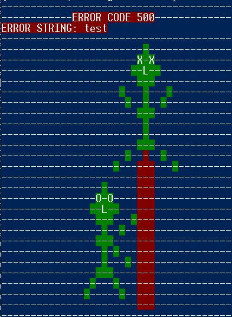

<center>

# Fun and clear error-messages


</center>

```
npm install errorDrawings
```

Get <i><u>a picture</u></i> of what the script does:

```
npm run test
```

## ECMAScript Modules

Use the error object "e" as parameter in "errorDrawing(e)"

```
import errorDrawing from "./node_modules/error-drawings/src/errorDrawing";


async function myExample(){
try{
    myfunctionThatWillReturnError()
} catch(e){
    errorDrawing(e)
    }
}

```

### Expected output:



### We are looking for contributors

#### Upcoming features:

- Saving the full error object in a convinient file in an error-folder
- Outputed tips and tricks of how to solve the error
- More fun images
